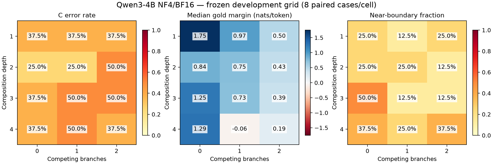

# v3.4.2 diagnosis

<!-- v342 observed-outcome start -->

**Outcome: gate failed because the frozen position-bias exclusion fired.** D3B0, D4B2 meet all other development criteria. The first candidate is selected 54/96 times; 34/38 wrong selections are at position 1. Held-out was not run. See the position table below for counts and interpretation limits.

<!-- v342 observed-outcome end -->

This is descriptive calibration of one pinned Qwen3-4B NF4/BF16 setup on synthetic relation graphs with real candidate names. It is not a propagation experiment or a population-level capability estimate.

1. **Does increasing depth reduce gold margin?** Adjacent median margin is non-increasing in 7/9 (77.8%) comparisons; 7 of 9 strictly decrease. Mean adjacent change is -0.2011 nats/token.

2. **Does increasing branching reduce gold margin?** Adjacent median margin is non-increasing in 7/8 (87.5%) comparisons; 7 of 8 strictly decrease. Mean adjacent change is -0.4536 nats/token.

3. **Which factor matters more?** The more negative average adjacent GM change is for branches on this grid. This compares one extra edge with one extra path, different interventions; it is not a general causal ranking. Full paired case tables expose variation hidden by medians.

4. **Are behavioral errors broadly monotonic?** Depth ER monotonicity: 6/9 (66.7%); branch ER monotonicity: 7/8 (87.5%). Strict increases: 3/9 and 3/8. Flat zero-error comparisons count as monotonic but do not establish increasing difficulty.

5. **Are margins more monotonic than errors?** Depth GM/ER proportions: 0.778/0.667; branch GM/ER: 0.875/0.875. These descriptive proportions include ties and are not significance tests.

6. **Which cases show boundary crossing?** dev-01, dev-05

7. **Are errors isolated spikes?** Error cells without local trend or the required near-boundary coverage: D1B0, D1B1, D1B2, D2B0, D2B1, D2B2, D3B1, D3B2, D4B0, D4B1

8. **Which development conditions qualify?** None meets all preregistered criteria. See frontier_selection.md for every failed criterion.

9. **Does held-out confirm?** Not evaluated because no development condition qualified; all twelve held-out targets remain unqueried.

10. **Frozen rule for v3.5?** None. The measurement gate fails; v3.5_authorized=false. No difficulty, threshold, candidate or prompt was changed after observing outputs.

Channel checks: C validity 96/96 (100.0%), free strict compliance 96/96 (100.0%), FCA 96/96 (100.0%), LCA 95/96 (99.0%). Free truncations: 0; possible short out-of-set answers: 0/96 (0.0%). Formatting failures never count as C errors.

## Development grid

| Depth | Branches | ER | Median gold margin | Near-boundary fraction |
|---|---|---|---|---|
| 1 | 0 | 3/8 (37.5%) | 1.7524 | 2/8 (25.0%) |
| 1 | 1 | 3/8 (37.5%) | 0.9682 | 1/8 (12.5%) |
| 1 | 2 | 3/8 (37.5%) | 0.5033 | 2/8 (25.0%) |
| 2 | 0 | 2/8 (25.0%) | 0.8415 | 2/8 (25.0%) |
| 2 | 1 | 2/8 (25.0%) | 0.7481 | 2/8 (25.0%) |
| 2 | 2 | 4/8 (50.0%) | 0.4275 | 1/8 (12.5%) |
| 3 | 0 | 3/8 (37.5%) | 1.2517 | 4/8 (50.0%) |
| 3 | 1 | 4/8 (50.0%) | 0.7280 | 1/8 (12.5%) |
| 3 | 2 | 4/8 (50.0%) | 0.3887 | 1/8 (12.5%) |
| 4 | 0 | 3/8 (37.5%) | 1.2886 | 3/8 (37.5%) |
| 4 | 1 | 4/8 (50.0%) | -0.0602 | 2/8 (25.0%) |
| 4 | 2 | 3/8 (37.5%) | 0.1857 | 3/8 (37.5%) |

## Limits and stop decision

Depth and branch count both increase token count. Candidate identities can recur across splits; questions are disjoint synthetic targets, not unseen-person tests. Path block order is frozen per case, not separately ablated. The synthetic graph links are not evidence about real films. No independent human audit or causal position-sensitivity claim is made; graph uniqueness is checked by parsing every rendering and position bias uses a frozen descriptive rule. Case labels may include both non-monotonicity and boundary crossing. No extra difficulty levels were tried.
No development frontier: stop after the frozen grid and inspect these artifacts. Do not expand or tune on held-out.

## Position and case diagnostics

The preregistered pooled POSITION_BIAS flag is **True**. D3B0, D4B2 meets all other development criteria but is not selected. No new threshold, candidate ordering, or model call was introduced in this presentation step.

| Candidate position | Times selected / 96 | Gold occurrences | Wrong selections | Wrong selections when gold elsewhere / 72 | Share of 38 errors |
|---|---|---|---|---|---|
| 1 | 54/96 | 24 | 34 | 34/72 | 89.5% |
| 2 | 9/96 | 24 | 0 | 0/72 | 0.0% |
| 3 | 5/96 | 24 | 0 | 0/72 | 0.0% |
| 4 | 28/96 | 24 | 4 | 4/72 | 10.5% |

Always-wrong base cases: dev-04, dev-07; these contribute 24/38 errors. The 96 decisions are repeated measurements on eight base cases, not 96 independent cases. Because candidate identities remain at fixed positions within each case, the position flag cannot distinguish index preference from candidate-identity or case effects. It is a conservative exclusion signal, not proof of a causal position effect. No candidate-order counterfactual was run.

The observed axis is partly ordered, not globally monotonic: depth ER/GM satisfy 6/9 and 7/9 adjacent comparisons, while branch ER/GM both satisfy 7/8. Margin support at selected-looking cells does not override the position exclusion. The held-out split remains unqueried.

