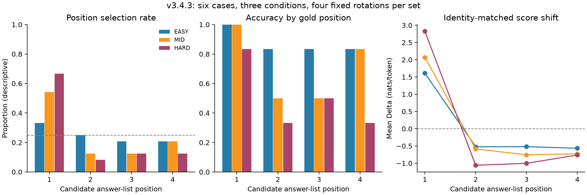

# v3.4.3 diagnosis

Completed 72 new prompts through F/C/L: 18 paired case-condition sets nested in six selected cases. Candidate-list order alone was manipulated; evidence order and graph content were unchanged. No independent-prompt significance test or population inference is made.

Descriptive outcome flags: A_strong_position, C_difficulty_dependent_position.

1. **Does candidate position causally affect selection?** 11/18 sets change selected identity across the four rotations. With verified prompt invariance, this is a behavioral causal effect of the candidate-list-order intervention on these inputs.

2. **Is position 1 privileged?** PSR1=37/72 (51.4%) versus the counterbalanced reference 0.25; position-1 locked sets=6/18. Mean position-1 Delta=2.1688 nats/token; median of set means=1.9983.

3. **Were prior errors position-driven or identity/case-driven?** Classification counts: {'MIXED_POSITION_IDENTITY': 1, 'POSITION_1_LOCKED': 6, 'UNSTABLE_OTHER': 4, 'GOLD_STABLE': 7}; mean ISR=0.722. Descriptive flags: ['A_strong_position', 'C_difficulty_dependent_position']. The selected control cases address major contributors but do not estimate a population fraction or assign a cause to every one of the prior 38 errors.

4. **What happens to dev-04 and dev-07?** dev-04: EASY=MIXED_POSITION_IDENTITY, MID=POSITION_1_LOCKED, HARD=POSITION_1_LOCKED; dev-07: EASY=UNSTABLE_OTHER, MID=UNSTABLE_OTHER, HARD=POSITION_1_LOCKED. Their old position-1 identity appears at positions 1,4,3,2 across P1–P4; inspect the identity and position traces rather than counting first-slot errors alone.

5. **Does dev-05 retain boundary crossing?** EASY: error fraction 0.00, median margin 2.7774, GOLD_STABLE; MID: error fraction 0.25, median margin 0.1614, UNSTABLE_OTHER; HARD: error fraction 1.00, median margin -2.2653, POSITION_1_LOCKED. A strict correct EASY / wrong MID and HARD pattern with decreasing margins survives in 1/4 fixed-permutation trajectories. Full trajectories are in dev05_trajectories.json.

6. **Do always-easy controls remain stable?** dev-06: EASY=GOLD_STABLE, MID=UNSTABLE_OTHER, HARD=GOLD_STABLE; dev-08: EASY=GOLD_STABLE, MID=GOLD_STABLE, HARD=GOLD_STABLE. GOLD_STABLE is required to call a case-condition robust across all four orders.

7. **Does position sensitivity increase with difficulty?** EASY: PSR1=0.333, literal PFR=0.222, mean Delta1=1.6109; MID: PSR1=0.542, literal PFR=0.444, mean Delta1=2.0694; HARD: PSR1=0.667, literal PFR=0.611, mean Delta1=2.8259. Descriptive interaction flag C=True; this is not an internal cognitive-mechanism claim.

8. **Does the same identity receive higher likelihood in position 1?** Identity-matched Delta1 mean=2.1688; median of set means=1.9983; identity-level median=1.9349. Each contrast holds identity, graph and question fixed; position_effects.json retains all contrasts.

9. **Do MID/HARD remain plausible frontier regimes?** MID: equal-case error=29.2%, median-of-case-margins=0.6427, NBF=50.0%, heuristic=True; HARD: equal-case error=50.0%, median-of-case-margins=-0.8592, NBF=8.3%, heuristic=False. These summaries do not replace a new clean development/confirmation split.

10. **What exact order policy should future v3.5 use?** No clean route is supported. Resolve answer-option order sensitivity before any propagation study. If future validation supports a propagation study, use the same four fixed cyclic rotations per case-condition so each identity occupies every slot once, keep evidence/name records canonical, preregister any randomized base order with a seed, and aggregate per case. This run does not authorize or launch v3.5.

## Position-conditioned results

| Position | PSR | Gold-position accuracy | Mean Delta | Median set-mean Delta |
|---|---|---|---:|---:|
| 1 | 37/72 (51.4%) | 17/18 (94.4%) | 2.1688 | 1.9983 |
| 2 | 11/72 (15.3%) | 10/18 (55.6%) | -0.7235 | -0.6970 |
| 3 | 11/72 (15.3%) | 11/18 (61.1%) | -0.7601 | -0.7435 |
| 4 | 13/72 (18.1%) | 12/18 (66.7%) | -0.6852 | -0.8328 |

Literal PFR=23/54 (42.6%); strict PFR over all transitions=16/54 (29.6%); conditional strict PFR=16/31 (51.6%). Literal PFR does not require the previous first option to have been selected; it can include stable-identity transitions and must not be read alone.

C validity=72/72 (100.0%), F strict compliance=68/72 (94.4%), FCA=68/68 (100.0%), LCA=72/72 (100.0%). Free truncations=4; short out-of-set-name flags=0.

All 18 P1 inputs match v3.4.2 byte-for-byte. New P1 C choices reproduce 18/18; free raw outputs reproduce 18/18. Maximum mean-score difference=0.00000000. All calls are newly run, not reused prior outputs.

This tests candidate answer-list order, separately from v3.3 evidence order. Cyclic rotations balance absolute positions but do not exhaust all 24 orderings or isolate every relative-neighbor effect. A sequence that changes choices need not be purely position-1 driven; classifications and paired scores distinguish these patterns. No claim about internal attention or a shared internal primacy mechanism is supported.

## Observed case-level interpretation

The controlled rotations support a candidate-position effect that increases with difficulty in this selected sample. They do not support a universal always-first strategy: identity/case dependence remains, and several sets are gold-stable. No non-gold identity is selected in all four orders of any set.

- dev-04: original first identity **Tinnu Anand** is selected 3/3 times in P1 across the three difficulties, but only 1/9 times after it moves to positions 4/3/2. This contradicts an order-invariant wrong-identity lock, without implying all remaining choices follow position 1.
- dev-07: original first identity **León Klimovsky** is selected 3/3 times in P1 across the three difficulties, but only 0/9 times after it moves to positions 4/3/2. This contradicts an order-invariant wrong-identity lock, without implying all remaining choices follow position 1.

For dev-05, gold margin declines strictly EASY→MID→HARD in **4/4** fixed-order trajectories, and EASY-correct→HARD-wrong occurs in **4/4**. The original MID error survives in only **1/4** orders. Thus degradation across complexity remains, while the location of the behavioral boundary changes with candidate order; the reported 1/4 strict original-pattern retention must not be read as absence of all complexity effects.

Four F outputs first emit a candidate and then begin reconsideration/explanation before truncating at the frozen 96-token cap. Their one-name extraction is auxiliary only: it is not a completed natural answer or strict compliance. The run does not establish whether longer free reasoning would repair them. C measures guided candidate choice; agreement with F is 68/68 among strict outputs, not 72/72 completed free answers.

MID retains diagnostic frontier-like averages, but its PSR1 remains 54.2%; HARD has PSR1 66.7% and only 8.3% near-boundary coverage. Counterbalancing equalizes identity exposure; it does not eliminate the model's observed first-position preference. Neither clean route is supported, and no propagation run is authorized.

