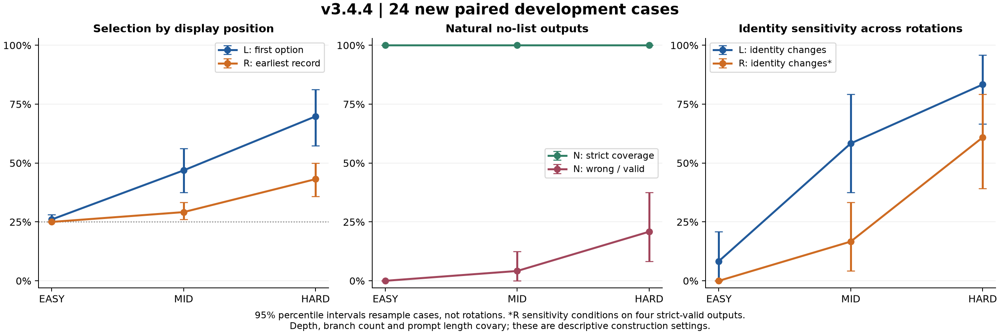

# v3.4.4 — Answer interfaces and presentation sensitivity

First-hop measurement only; no downstream calls, NPR, SHAR/HalluSE or v3.5 execution. Twenty-four new development cases, 16 frozen confirmation cases, and six selected old diagnostic cases. All 40 new candidate bundles, targets and graph nodes are new; people are reused from audited evidence.

## Exact execution counts

```json
{
  "status": "completed",
  "development_renderings": 648,
  "old_renderings": 90,
  "confirmation_renderings": 144,
  "total_renderings": 882,
  "main_channel_evaluations": 2116,
  "smoke_channel_evaluations": 8,
  "harness_channel_evaluations": 3
}
```

N and R1 duplicate text is independently queried, not silently reused. Confirmation plans at unselected difficulties are frozen but never queried.

| Cohort | Difficulty | L wrong / prompts | L first / prompts | L sensitive / cases | N valid / all | N wrong / valid | R sensitive / complete cases | R earliest / valid |
|---|---|---|---|---|---|---|---|---|
| confirmation | EASY | 4/64 (6.2%) | 19/64 (29.7%) | 4/16 (25.0%) | 16/16 (100.0%) | 0/16 (0.0%) | 0/15 (0.0%) | 16/63 (25.4%) |
| development | EASY | 3/96 (3.1%) | 25/96 (26.0%) | 2/24 (8.3%) | 24/24 (100.0%) | 0/24 (0.0%) | 0/24 (0.0%) | 24/96 (25.0%) |
| development | MID | 25/96 (26.0%) | 45/96 (46.9%) | 14/24 (58.3%) | 24/24 (100.0%) | 1/24 (4.2%) | 4/24 (16.7%) | 28/96 (29.2%) |
| development | HARD | 52/96 (54.2%) | 67/96 (69.8%) | 20/24 (83.3%) | 24/24 (100.0%) | 5/24 (20.8%) | 14/23 (60.9%) | 41/95 (43.2%) |
| old | EASY | not run | not run | not run | 6/6 (100.0%) | 0/6 (0.0%) | 0/5 (0.0%) | 6/23 (26.1%) |
| old | MID | not run | not run | not run | 6/6 (100.0%) | 0/6 (0.0%) | 1/6 (16.7%) | 7/24 (29.2%) |
| old | HARD | not run | not run | not run | 6/6 (100.0%) | 2/6 (33.3%) | 5/6 (83.3%) | 11/24 (45.8%) |

Development selected **N / EASY**. Confirmation pass: **True**. Licensed claim: natural single-trajectory first-hop selection. Error-yield insufficient: True.

Case-bootstrap percentile 95% intervals are in metrics.json; the resampling unit is the base case. Engineering thresholds do not prove absence of bias. All invalid categories are reported separately, never counted correct. Scores exclude EOS and are not probabilities. Depth, branches and prompt length covary.

Wrong-state persistence on new development data: L same-wrong 4/4 = **0/72 cells**; R same-wrong 4/4 = **0/72 cells**; wrong R aggregates = **0/67 resolved cells**. These 72 repeated cells belong to 24 base cases. A wrong canonical N answer alone does not establish an order-stable wrong state.

See [supplementary diagnostics](supplementary_diagnostics.md) for zero-inclusive category counts, explicit channel-disagreement denominators, token-length ranges and hypothesis decisions.


