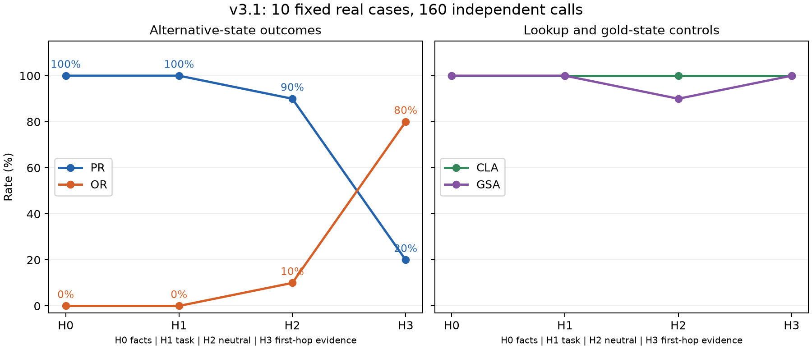

# v3.1 real-entity context ladder: reviewed diagnosis

**Smoke gate PASS.** All 160 planned calls completed; 9/10 cases meet the predefined cross-H0–H2 interpretability rule. The one gold-state failure remains in the fixed sample and all primary rate denominators. No outputs were retried or cases replaced.

| Context | CLA B | CLA B′ | Combined CLA | GSA | PR | OR | SFIR B | SFIR B′ | ΔPR vs H0 |
|---|---:|---:|---:|---:|---:|---:|---:|---:|---:|
| H0: downstream facts | 10/10 | 10/10 | 20/20 | 10/10 | 10/10 | 0/10 | 0/10 | 0/10 | — |
| H1: + original task | 10/10 | 10/10 | 20/20 | 10/10 | 10/10 | 0/10 | 0/10 | 0/10 | 0 pp |
| H2: + neutral sentence | 10/10 | 10/10 | 20/20 | 9/10 | 9/10 | 1/10 | 1/10 | 1/10 | −10 pp |
| H3: + first-hop evidence | 10/10 | 10/10 | 20/20 | 10/10 | 2/10 | 8/10 | 0/10 | 8/10 | −80 pp |

At every level, alternative-state OUT_OF_CONTEXT_HALLUCINATION, UNKNOWN_REJECT and INVALID_OUTPUT are all 0/10. There are no unresolved alias judgments, placeholders, truncations or format failures anywhere in the 160 calls. Every answer names one of the two controlled downstream targets. SFIR conditions on correct direct lookup; all direct controls pass here, so every SFIR denominator is ten.

## 1. Real-entity calibration at H0

H0 reproduces the successful minimal-context behavior from v3: both direct controls and both state branches succeed for every real case. The explicit reference facts remove the closed-book recall prerequisite. This is a calibration result on the selected set, not a matched estimate of a synthetic-versus-real entity effect; v3.1 uses different entities and tasks.

## 2. Restoring the original task at H1

H1 changes no measured outcome. All ten supplied B′ states still lead to C′, while both direct lookups and gold-state controls remain exact. Merely restoring the original multi-hop question does not overcome the supplied state on these cases with this prompt form.

## 3. Neutral accumulated context at H2

H2 produces two distinct changes, in different cases:

- **real-01 (Feng Xiaoning / Rolf Schübel):** the added sentence describes the film as China's official Academy Awards submission. Under supplied Rolf Schübel, the state answer changes from Stuttgart to Xi'an, the gold downstream target. Direct Rolf Schübel lookup still returns Stuttgart and the gold-state branch remains correct. This is a within-case PROPAGATE → OVERRIDE_TO_GOLD transition without loss of direct access to the fact.
- **real-04 (Rodrigo Grande / Fridrikh Ermler):** the added sentence describes a Seattle film-festival award. Under the gold state Rodrigo Grande, the model returns Rēzekne (the other reference target) instead of Rosario. Direct lookup of Rodrigo Grande still returns Rosario; the B′ state correctly yields Rēzekne. This is gold-state framing interference / OTHER_CONTEXT_TARGET, not an unsupported answer. It makes this case fail the cross-H0–H2 interpretability criterion. The gold-state result returns to Rosario at H3.

Thus the H2 effect is not specific to alternative/error states: one gold-state control also fails. The sentences are neutral in the stipulated explicit-identity/answer sense, not devoid of geographic or topical associations. Country cues, attention to another target, added length or other prompt interactions could matter; these observations do not establish an internal mechanism.

## 4. Contradictory first-hop evidence at H3

Eight alternative-state outputs return C rather than C′. Seven cases newly override relative to H2, while real-01 continues its H2 override. Only **real-06 (Ildikó Enyedi / Armando Robles Godoy)** and **real-07 (Tinnu Anand / Leopoldo Torre Nilsson)** retain PROPAGATE throughout H0–H3. Both are father-relation cases, but three father cases are insufficient to infer a general relation-type effect.

H3's 8/10 OVERRIDE_TO_GOLD is an intended scientific outcome, not a failed gate. The same H3 context establishes the original director identity for both branches; only B versus B′ changes. For the B′ branch this introduces a conflict with the original task's gold trajectory. The model often returns the gold trajectory's value despite the supplied state. The result is consistent with context-dependent prioritization of first-hop evidence/original-task framing over the state instruction, but does not prove a particular internal repair process.

## 5. Separation from context lookup failure

Every direct B and B′ lookup remains exact at every level (80/80 overall), including the eight H3 override cases. H3 gold-state controls are also 10/10. Therefore the observed H3 PR reduction cannot be explained by failure to retrieve the explicitly stated C′ under direct questioning. The matched state framing and task/evidence conflict are relevant to the observed change. The H2 gold-state error is retained as an explicit limitation rather than concealed by changing the sample or denominator.

## 6. State-frame stability

SFIR B is 0%, 0%, 10%, 0%; SFIR B′ is 0%, 0%, 10%, 80% across H0–H3. The last value consists entirely of meaningful overrides to C, not malformed or out-of-context answers. It measures deviation from the supplied B′ state under this framing, and should not be described as an 80% general context-understanding failure. Direct controls and the gold-state branch remain stable at H3.

## Scope and reproducibility

The findings are descriptive paired observations for ten evidence-selected director-based cases, four context levels and one model/decoding configuration. Cases share a domain, and the context levels are repeated measurements, not independent observations. No population-level, statistical-significance or spontaneous-hallucination claim is supported. H2 and H3 add particular content and length together; the original H3 first-hop sentence can include film metadata as well as the director identity. The result is about these context blocks, not context length alone.

The evidence order is balanced five/five across cases but held fixed within a case. There was no real-entity within-case order reversal in this 160-call design. Frozen candidates, declared aliases, the pre-inference context audit, threshold policy, exact prompts, raw responses and source hashes are retained. All 75 previous experiment artifact files remain byte-identical. The cached Qwen3-4B model ran in NF4/BF16 entirely on GPU; fresh single-user calls had KV caching disabled and used the same 32-token cap as v3. Peak reserved memory was about 3.26 GiB. Thirty-six regression tests pass.

The experiment ends here under specification §22: **“Do not automatically proceed.”** No natural-trajectory branching, additional model-family experiment or SHARS/HalluSE intervention was started. Human review remains pending before any next experiment.
