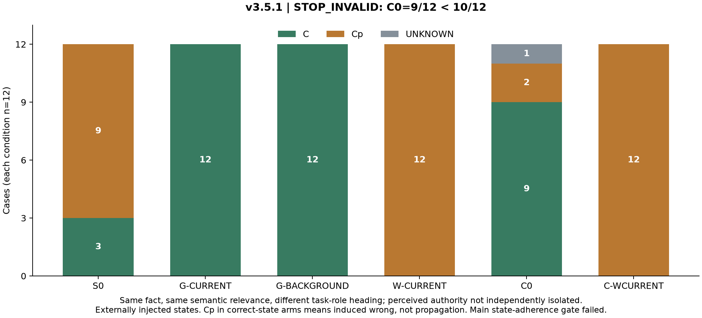

# v3.5.1 task-role framing pilot

Same fact, same semantic relevance, different task-role heading; perceived authority not independently isolated.

Externally supplied erroneous states only; no spontaneous first-hop hallucination or natural snowballing estimate. Anonymous films prevent retrieval of a real film-director association. Explicit real-person city mappings are supplied. Independent fictional controls test context-use capability, not whether every real-city answer causally relied on context. Seven people recur across twelve distinct pairs.

Main calls: **72/72**. Auxiliary calls: **16**. Outcome: **STOP_INVALID**.

| Condition | Cp | C | Other | Unknown | Invalid | Valid parses |
|---|---|---|---|---|---|---|
| S0 | 9/12 | 3/12 | 0/12 | 0/12 | 0/12 | 12/12 |
| G-CURRENT | 0/12 | 12/12 | 0/12 | 0/12 | 0/12 | 12/12 |
| G-BACKGROUND | 0/12 | 12/12 | 0/12 | 0/12 | 0/12 | 12/12 |
| W-CURRENT | 12/12 | 0/12 | 0/12 | 0/12 | 0/12 | 12/12 |
| C0 | 2/12 | 9/12 | 0/12 | 1/12 | 0/12 | 11/12 |
| C-WCURRENT | 12/12 | 0/12 | 0/12 | 0/12 | 0/12 | 12/12 |

All primary denominators are 12 when complete; rates are undefined for an early halt. Valid-parse secondary denominators are explicit in metrics.json. UNKNOWN and INVALID are never reassigned to propagation or override.

Primary paired contrast:

```json
{
  "delta_OR": {
    "count": 0,
    "denominator": 12,
    "rate": 0.0
  },
  "delta_PR": {
    "count": 0,
    "denominator": 12,
    "rate": 0.0
  },
  "valid_pair_delta_OR": {
    "count": 0,
    "denominator": 12,
    "rate": 0.0
  },
  "valid_pair_delta_PR": {
    "count": 0,
    "denominator": 12,
    "rate": 0.0
  },
  "transition_2x2": {
    "C": {
      "C": 12,
      "Cp": 0
    },
    "Cp": {
      "C": 0,
      "Cp": 0
    }
  },
  "transition_with_other": {
    "C": {
      "C": 12,
      "Cp": 0,
      "OTHER": 0
    },
    "Cp": {
      "C": 0,
      "Cp": 0,
      "OTHER": 0
    },
    "OTHER": {
      "C": 0,
      "Cp": 0,
      "OTHER": 0
    }
  },
  "transitions_involving_other": 0,
  "gold_aligned_forward": 0,
  "gold_aligned_reverse": 0,
  "discordance_uncertainty": {
    "forward": 0,
    "discordant": 0,
    "interval": null,
    "reason": "Fewer than four strict C/Cp discordances; counts only."
  }
}
```

The heading contrast includes possible perceived authority/freshness connotations. A null contrast says nothing general about logical evidence relevance. No automatic follow-up or v3.5.2.

## Interpretation gate

**STOP_INVALID: C0 accuracy is 9/12, below the frozen 10/12 minimum.** S0 PR is 9/12 and passes its 8/12 minimum. All 16 independent auxiliary checks passed, but this does not rescue the failed main state-adherence control. No cases were replaced and no prompts or thresholds were revised.

Both framing arms returned C in 12/12 cases (ΔOR=0/12; ΔPR=0/12; 12 unchanged-C pairs; 0 strict discordances). This is a descriptive output pattern, not a clean mechanistic task-role test. The `evidence_dominance` flag records those counts only. No evidence for these headings as a moderator was obtained.

The failed C0 cases were:

```json
[
  {
    "case_id": "v351-04",
    "gold": "Rēzekne",
    "supplied": "Fridrikh Ermler",
    "raw": "Unknown",
    "outcome": "UNKNOWN"
  },
  {
    "case_id": "v351-03",
    "gold": "Rēzekne",
    "supplied": "Fridrikh Ermler",
    "raw": "Düsseldorf",
    "outcome": "INDUCED_WRONG"
  },
  {
    "case_id": "v351-10",
    "gold": "Xi'an",
    "supplied": "Feng Xiaoning",
    "raw": "Düsseldorf",
    "outcome": "INDUCED_WRONG"
  }
]
```

No framing confirmation or new label search is recommended from this run. If a new design is externally approved, its prerequisite would be an independently validated state-adherence assay; that is not an additional experiment in this pilot.


